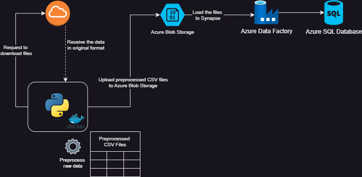

# ScrollGuard
ScrollGuard is the simplified application for sanction and AML screening. This project is composed of three components: data pipeline, screening API, and a screening user interface.

## ScrollGuard Data Pipeline overview

The ScrollGuard data pipeline pulls sanctions listings from various entities (such as UN and HM, etc).
- The raw files are downloaded using Python from their respective sources in their respective raw format
- The files are then preprocessed based on pre-defined transformation steps on the `config.json` file
- The preprocessed files are saved to CSV format and are uploaded to Azure Blob Storage
- The files in the Blob Storage are then preprocessed further via pipelines in Azure Synapse

## Prerequisites
- Python 3.11
- Poetry 1.8.2
- Docker

## Setup
Depending on your preferred approach, create a `.env` file to store Azure Storage Account connection string. Refer to `.env-sample`.

### Via Poetry
- Run `poetry install` to install all project dependencies 
- Run `poetry run python app.py` to run the app

## Via Docker
- Run `docker build -t name . --no-cache` to build the Docker image
- Run `docker run name` to run the image